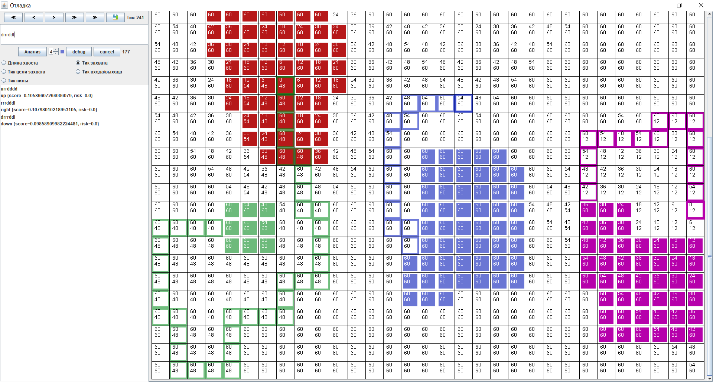

# Стратегия занявшая второе место в [Mini AI Cup 4: Paper IO](https://github.com/MailRuChamps/miniaicups/tree/master/paperio)

Примеры игр можно найти [здесь](https://aicups.ru/profile/2692/)

---
Немного поэкспериментировав с [MCTS], 
так и не придумав как же можно его эффективно использовать для решения поставленной задачи, 
решил начать с генерации множества прямоугольных маршрутов (с двумя, а потом с тремя поворотами) 
и их последующей оценкой. 
  
## Алгоритм стратегии
Высокоуровнево, алгоритм стратеии можно представить следующеми 6 пунктами:
> 1.	Прочитать состояние мира
> 2.	Преобразовать объекты сообщения в рабочие объекты
> 3.	Сформировать набор прямоугольных маршрутов
> 4.	Оценить каждый из сформированных маршрутов
> 5.	Выбрать лучший маршрут
> 6.	Отправить команду

Этот алгоритм так и не изменился по ходу соревнования.
Модифицировались лишь способ формирования маршрутов бота и их оценка. 

Класс [SimpleStrategy] содержит начальную версию стратегии, а класс [BestStrategy] улучшеная версия, которая и заняла 2 место в соревновании.   

### Чтение состояния мира
Состояние мира передается в виде [JSON] обьекта через [STDIN]. 
Увидел в [pom.xml](https://github.com/MailRuChamps/miniaicups/blob/master/paperio/dockers/java1.8/pom.xml), 
что можно воспользоваться библиотекой [Gson] и задача чтения состояния 
мира существенно упростилась. 
> 1. Описал формат передаваемого сообщеня классом [Message]. 
> 2. При помощи библиотеки [Gson] десереализовал [JSON] строку, прочитанную из стандартного потока ввода, 
в экземпляр класса [Message]. 

**Фрагмент кода чтения состояния мира (класс [Main])**
```java
    Gson gson = new Gson();
    BufferedReader reader = new BufferedReader(new InputStreamReader(System.in));  
    while (true) {
        line = reader.readLine();
        Message message = gson.fromJson(line, Message.class);
        ...
    }    
```           

### Создание рабочих объектов
Использовать транспортные объекты в основном коде программы как правило не очень удобно 
и архитектурно неверно. Например, организаторы в силу тех или иных причин могут изменить 
формат сообщений. Поэтому, надо преобразовать транспортные объекты в рабочие, которые и будут 
использоваться в основном коде программы.  
- Классы [Player] и [PlayerState] сохраняют состояние бота, а утилитный класс [MessagePlayer2PlayerConverter] 
помогает создать эти классы на основе данных из траспортного сообщения.  
- Класс [Bonus] содержит информацию о бонусе клетки игрового поля.

**Фрагмент кода создания рабочих объектов (класс [Main])**
```java
    Player me = null;
    List<Player> others = new ArrayList<>();
    for (Map.Entry<String, Message.Player> entry : message.params.players.entrySet()) {
        Player player = playerConverter.convert(entry.getKey(), entry.getValue());
        if (entry.getKey().equals("i")) {
            me = player;
        } else {
            others.add(player);
        }
    }
    Map<Cell, Bonus> bonusMap = stream(message.params.bonuses)
            .collect(toMap(bonus -> point2cell(bonus.position[0], bonus.position[1]),
                    bonus -> new Bonus(bonus.type, bonus.active_ticks)));
```

### Формирование маршрутов 
В первых версиях стратегии ([SimpleStrategy]) путь задавался при помощи классов [MovePlanWithScore] и [Move].

**Фрагмент класса [Move]**
```java
public class Move {
	// Направление движения
	private Direction direction;
	//Сколько клеток двигаться в направлении direction
	private int length;

	public Move(Direction direction) {
		this.direction = direction;
		this.length = Integer.MAX_VALUE;
	}

	public Move(Direction direction, int length) {
		this.direction = direction;
		this.length = length;
	}
```

**Фрагмент класса [MovePlanWithScore]**
```java
public class MovePlanWithScore implements Comparable<MovePlanWithScore> {
	// план движения бота
	private final Move[] moves;
	// оценка плана
	private double score;
	private double risk;

	public MovePlanWithScore(Move... moves) {
		this.moves = moves;
	}
```

**Фрагмент кода формирования маршрутов из класса [SimpleStrategy]**
```java
protected List<MovePlanWithScore> generatePlans(Set<Direction> directions) {
    List<MovePlanWithScore> plans = new ArrayList<>();
    for (Direction m1d : directions) {
        plans.add(new MovePlanWithScore(new Move(m1d))); // пока не упремся или не замкнем территорию
        for (int m1 = 1; m1 < 15; m1++) {
            for (Direction m2d : Direction.values()) {
                if (m2d.isOpposite(m1d) || m2d == m1d) continue;
                plans.add(new MovePlanWithScore(new Move(m1d, m1), new Move(m2d))); // для 2го хода пока не упремся
                for (int m2 = 1; m2 <= 10; m2 += 2) {
                    plans.add(new MovePlanWithScore(new Move(m1d, m1), new Move(m2d, m2), new Move(m1d.opposite())));
                    for (int m3 = 1; m3 <= 15; m3++) {
                        plans.add(new MovePlanWithScore(new Move(m1d, m1), 
                                                        new Move(m2d, m2), 
                                                        new Move(m1d.opposite(), m3), 
                                                        new Move(m2d.opposite())));
                    }
                }
            }
        }
    }
    return plans;
}
```

Такое формирование траекторий движения бота было не очень эффективным 
с точки зрения производительности, так как приходилось по нескольку раз обсчитывать 
одни и те же траектории, но было очень полезным для осмысления механики игры. 

В поздних версиях стратегии [BestStrategy] стал применять дерево маршрутов. 
Класс [MoveNode] отражает узел этого дерева. Дерево полностью формируется на старте стратегии. 
Обратите внимание на метод `init` класса [MoveNode]. Он очень похож на `generatePlans` класса [SimpleStrategy].

**Фрагмент кода класса MoveNode**
```java
public class MoveNode {
    private final Map<Direction, MoveNode> nodes = new EnumMap<>(Direction.class);
    private final Direction direction;

    public MoveNode() {
        this.direction = null;
        init(this, Game.MAX_PLAN_LENGTH);
    }

    public MoveNode(Direction direction) {
        this.direction = direction;
    }

    public MoveNode createPath(Direction direction, int length) {
        MoveNode node = this;
        for (int i = 0; i < length; i++) {
            MoveNode next = node.nodes.get(direction);
            if (next == null) {
                next = new MoveNode(direction);
                node.nodes.put(direction, next);
            }
            node = next;
        }
        return node;
    }

    public static void init(MoveNode root, int planLength) {
        for (Direction d1 : Direction.values()) {
            for (int m1 = 1; m1 <= planLength; m1++) {
                MoveNode node1 = root.createPath(d1, m1);
                for (Direction d2 : Direction.values()) {
                    if (d2 == d1 || d2 == d1.opposite()) continue;
                    for (int m2 = 1; m2 <= planLength - m1; m2++) {
                        MoveNode node2 = node1.createPath(d2, m2);
                        for (Direction d3 : Direction.values()) {
                            if (d3 == d2 || d3 == d2.opposite()) continue;
                            for (int m3 = 1; m3 <= planLength - m1 - m2; m3++) {
                                MoveNode node3 = node2.createPath(d3, m3);
                                int m4 = planLength - m1 - m2 - m3;
                                if (m4 > 0) {
                                    for (Direction d4 : Direction.values()) {
                                        if (d4 == d3 || d4 == d3.opposite()) continue;
                                        node3.createPath(d4, m4);
                                    }
                                }
                            }
                        }
                    }
                }
            }
        }
    }
```

Здесь, думаю, можно было чуть улучшить, добавив еще один поворот. Принципиально, рассматриваемый маршрут мало чем отличается от первой версии.  
  
### Оценка маршрута

Для оценки маршрута ввел два показателя: score и risk. 
Score – примерно отражает количество набранных очков на один тик пути, 
а risk – количество тиков, которых не хватает для завершения пути 
(например, из-за того что соперник может схватить за хвост). 
Risk появился не сразу. В первой версии, если бот вдруг обнаруживал на середине 
пути что он не успевает – «сходил с ума», так как все опасные пути для него были одинаково плохими.
Из всех рассматриваемых маршрутов выбирается самый «безопасный» с максимальным количеством очков на один тик пути. 
       
В первых версиях стратегии score считался только на основе захваченной территории и немного 
учитывались бонусы. 

Фрагмент кода для расчета показателя score из класс [SimpleStrategy]. 
```java
private int calculateMoveScore(List<Cell> capturedCells, Map<Cell, Bonus> bonusMap) {
    int result = capturedCells.size();
    int bonusResult = 0;
    
    for (Cell cell : capturedCells) {
        if (otherPlayerTerritory.isTerritory(cell)) {
            result += 4;
        }
    
        Bonus bonus = bonusMap.get(cell);
        if (bonus != null) {
            switch (bonus.getBonusType()) {
                case n:
                    bonusResult += bonus.getCells() / 2;
                    break;
                case s:
                    bonusResult -= bonus.getCells() / 2;
                    break;
                case saw:
                    bonusResult += 30;
                    break;
            }
        }
    }
    
    if (result > 0) {
        result += bonusResult;
    }
    
    return result;
}
```

Для оценки безопасности маршрута я расчитываю матрицу достижимости: 
для каждой клетки игрового поля рассчитываю тик, на котором в ней может оказаться бот соперника. 
Сначала рачитывался только тик. Позже добавил расчет длины хвоста. Бонусы, которые можно подобрать по пути, 
также не учитывались в первых версиях стратегии. Класс [TimeMatrixBuilder] расчитывает матрицы тиков и длин хвоста 
ботов сопреников. Далее эти матрица используются для оценки риска. 
Если мой бот находится на своей территории в момент расчета очередного хода - рисковым маршрутам присваевается 
максимальный уровень риска, если бот был уже в пути на чужой или нейтральной территории риск оценивается как разница
тиков завершения пути (бот пришел на свою территорию) и тика когда ему может гразить опасность (например, чужой бот 
может наступить на хвост).  

Для нахождения захваченных клеток использую следующий алгоритм (фрагмент кода утилитного класса [Game]):
```java
public static List<Cell> capture(PlayerTerritory playerTerritory, PlayerTail tail) {
    List<Cell> result = new ArrayList<>();
    int[] voids = new int[sizeX * sizeY];
    List<Boolean> zones = new ArrayList<>();

    for (int i = 0; i < sizeX; i++) {
        for (int j = 0; j < sizeY; j++) {
            Cell cell = cell(i, j);
            if (!playerTerritory.isTerritory(cell) && !tail.isTail(cell)) {
                if (voids[cell.getIndex()] == 0) {
                    boolean captured = markVoids(playerTerritory, tail, zones.size() + 1, voids, cell(i, j));
                    zones.add(captured);
                }
                if (zones.get(voids[cell.getIndex()] - 1)) {
                    result.add(cell);
                }
            } else if (tail.isTail(cell)) {
                result.add(cell);
            }
        }
    }
    return result;
}

private static boolean markVoids(PlayerTerritory playerTerritory, PlayerTail tail, int zone, int[] voids, Cell cell) {
    voids[cell.getIndex()] = zone;

    boolean result = !cell.isBorder();
    for (Direction direction : cell.directions()) {
        Cell neighbor = nextCell(cell, direction);
        if (voids[neighbor.getIndex()] == 0 && !playerTerritory.isTerritory(neighbor) && !tail.isTail(neighbor))
            result = markVoids(playerTerritory, tail, zone, voids, neighbor) && result;
    }
    return result;
}
```

Могие участники конкурса жаловались на странность и черезмерную вычислительную сложность алгоритма, 
который использовался организаоторами в [Local Runner]. Предположу, что это было сделано намеренно, 
чтобы не давать участникам конкурса готовых решений.    

Странно, но несмотря на примитивность алгоритма 
он показал себя достаточно хорошо – 10 место в песочнице. 
Правда, в предфинальном раунде стал быстро опускаться вниз: 
другие участники улучшали свои стратегии. 

Мой бот часто погибал. 
В первую очередь из-за того, что строился маршрут к территории, которая захватывалась ботами соперников. 
Путь неожиданно удлинялся и моего бота ловили за хвост. 
Часто погибал из-за неверного предсказания длины хвоста и скорости бота соперника. 
Например, бот соперника взявший замедление представлял опасность, так как при приближенном расчете стратегия полагала, 
что он должен был бы уже выйти из клетки, а он все еще был там. 
Для борьбы с этими проблемами стал рассчитывать большее количество показателей для каждой клетки игрового поля (классы [AnalyticsBuilder] и [CellDetails]).

**Показатели обсчета клетки игрового поля**
1.	Тик, на котором бот соперника сможет занять клетку (тик хватания за хвост)
2.	Тик, на котором бот соперника сможет войти в клетку
3.	Длина хвоста при входе в клетку
4.	Тик, на котором бот соперника сможет выйти из клетки
5.	Длина хвоста при выходе из клетки
6.	Тик, на котором клетка может быть захвачена ботом соперника
7.	Тик, на котором клетка может быть целью для захвата территории  
8.	Тик, на котором по клетке может быть нанесен удар пилой

Глубина аналитики ограничена 10 ходами.  
Думаю, можно было добиться большей глубины, 
отказавшись от обсчета отдельных соперников или ввести плавающую глубину, 
но времени на оптимизацию не хватило. 
В дополнение к [AnalyticsBuilder] стал использовать [SimpleTickMatrixBuilder] 
если не хватало глубины просчета [AnalyticsBuilder]. Результаты аналитики используются в [BestStrategy].

Функция оценки тоже немного улучшилась:
1.	Стал учитывать бонусы: штраф за взятие бонуса замедления и поощрение за взятие бонусов ускорения и пилы. 
В результате бот стал успешно избегать плохих бонусов и подбирал попутные хорошие.  
2.	Стал учитывать столкновение головами. 
Добавил немного очков за победное столкновение. Чем дальше возможное столкновение, тем меньше очков. 
3.	Чтобы понизить вероятность окружения добавил немного очков за взятие граничных клеток соперника. 
4.	Понизил ценность пустых клеток на границе: чем дальше от центра, тем меньше ценность. Наблюдая за боями финала, 
пришел к выводу что за сам факт захвата пустой клетки вообще не надо было начислять очков. 
Ценность пустой клетки должна зависить от близости к большим скопленям клеток противника. 
К сожалению, в финале уже нельзя было править стратегию.  
5.	Добавил очков за окружение головы бота соперника. 
Не уверен, что это как-то помогло. Может быть, с самыми простыми стратегиями. 
6.	Добавил очков даже за безрезультативное хватание за хвост (бот соперника успевал захватить территорию на том же тике в котором мой бот наступал ему на хвост). 
Точно не уверен, но думаю, что это мешало ботам соперника захватывать чужую территорию и им приходилось чаще возвращаться на свою. 
7.	В случае обнаружения возможной гибели от захвата сильно увеличивал стоимость граничных клеток территории соперника.

## Отладка стратегии
Сначала полагался на тесты, но быстро понял, что без проигрывания ранее сыгранных матчей сложно будет находить 
ошибки в коде и анализировать причины принятия ошибочных решений.  
В результате появился визуализатор [DebugWindow], в котором можно просмотреть пошагово ранее сыгранные игры, 
а также запустить отладку на нужном тике. Не очень красивый, написанный на скорую руку код, 
но он мне сильно помог при отладке. 




## Оптимизация
Чтобы не тратить время на создание объектов и работу GC, некоторые объекты постарался создать заранее. 
Это клетки игрового поля (класс [Cell]). Дополнительно для каждой клетки определил соседей. 
Дерево возможных путей (класс [MoveNode]).

Предполагал, что придется симулировать множество сценариев, а в процессе симуляции будет портится текущее состояние и 
его надо будет каждый раз восстанавливать. 
Поэтому для хранения состояния мира постарался использовать как можно более упакованные структуры. 
Для хранения занятой территории - BitSet (класс [PlayerTerritory]). Каждая клетка игрового поля пронумерована, 
а номер клетки соответствовал номеру бита в BitSet. Для хранения хвоста использовал BitSet совместно с ArrayDeque<Cell> 
(класс [PlayerTail]).

Правда я так и не дошел до проигрывания различных сценариев из-за нехватки времени. 
А так как основная функция расчета пути стала рекурсивной и все состояние можно было хранить на стеке - 
последние оптимизации мне не очень пригодились.

## Не реализованные идеи
При оценки риска маршрута моего бота я учитывал каждого сопреника независимо. 
На самом деле каждый из соперников тоже боится погибнуть. Поэтому, сотило бы это учитывать в оценке риска. 
По крайней мере это точно надо было учитывать в финальных играх.

Учет будущей гибели сопреника. Иногда случалось так, что бот захватывает территорию соперника, 
а сопреник неожиданно погибает. Обидно, так как в результате захватываешь только пустые клетки. 

Учет пустых клеток которые будут захвачены в ближайшем будущем в функции оценки.   


## Рекомендации и благодарности
Рекомендую всем разработчикам активно принимать участие в конкурсах AI Cups. 
Это развивает мышление и помогает через игру узнать новые алгоритмы. 
А как показал мой опыт, для занятия призового места достаточно немного усердия и 
даже простой и не очень оптимальный код может принести результат.

Большое спасибо организаторам. Несмотря на некоторые технические проблемы, конкурс получился интересным. 
С нетерпением жду следующих!    

")


[STDIN]: https://en.wikipedia.org/wiki/Standard_streams
[Local Runner]: https://github.com/MailRuChamps/miniaicups/tree/master/paperio#3-%D0%BE%D1%81%D0%BE%D0%B1%D0%B5%D0%BD%D0%BD%D0%BE%D1%81%D1%82%D0%B8-%D0%B7%D0%B0%D0%BF%D1%83%D1%81%D0%BA%D0%B0-local-runner
[Message]: https://github.com/volk1674/paperio/blob/master/src/main/java/message/Message.java
[Gson]: https://en.wikipedia.org/wiki/Gson
[JSON]: https://ru.wikipedia.org/wiki/JSON
[MCTS]: https://en.wikipedia.org/wiki/Monte_Carlo_tree_search
[Move]: https://github.com/volk1674/paperio/blob/master/src/main/java/strategy/model/Move.java
[MovePlanWithScore]: https://github.com/volk1674/paperio/blob/master/src/main/java/strategy/model/MovePlanWithScore.java
[SimpleStrategy]: https://github.com/volk1674/paperio/blob/master/src/main/java/strategy/SimpleStrategy.java
[AnalyticsBuilder]: https://github.com/volk1674/paperio/blob/master/src/main/java/strategy/AnalyticsBuilder.java
[CellDetails]: https://github.com/volk1674/paperio/blob/master/src/main/java/strategy/model/CellDetails.java
[SimpleTickMatrixBuilder]: https://github.com/volk1674/paperio/blob/master/src/main/java/strategy/SimpleTickMatrixBuilder.java
[BestStrategy]: https://github.com/volk1674/paperio/blob/master/src/main/java/strategy/BestStrategy.java
[MoveNode]: https://github.com/volk1674/paperio/blob/master/src/main/java/strategy/MoveNode.java
[Game]: https://github.com/volk1674/paperio/blob/master/src/main/java/strategy/Game.java

[Cell]: https://github.com/volk1674/paperio/blob/master/src/main/java/strategy/model/Cell.java
[PlayerState]: https://github.com/volk1674/paperio/blob/master/src/main/java/strategy/model/PlayerState.java
[Player]: https://github.com/volk1674/paperio/blob/master/src/main/java/strategy/model/Player.java
[PlayerTerritory]: https://github.com/volk1674/paperio/blob/master/src/main/java/strategy/model/PlayerTerritory.java
[PlayerTail]: https://github.com/volk1674/paperio/blob/master/src/main/java/strategy/model/PlayerTail.java
[Bonus]: https://github.com/volk1674/paperio/blob/master/src/main/java/strategy/model/Bonus.java
[Main]: https://github.com/volk1674/paperio/blob/master/src/main/java/Main.java
[MessagePlayer2PlayerConverter]: https://github.com/volk1674/paperio/blob/master/src/main/java/strategy/utils/MessagePlayer2PlayerConverter.java
[TimeMatrixBuilder]: https://github.com/volk1674/paperio/blob/master/src/main/java/strategy/TimeMatrixBuilder.java
[DebugWindow]: https://github.com/volk1674/paperio/blob/master/src/main/java/debug/DebugWindow.java
 


 